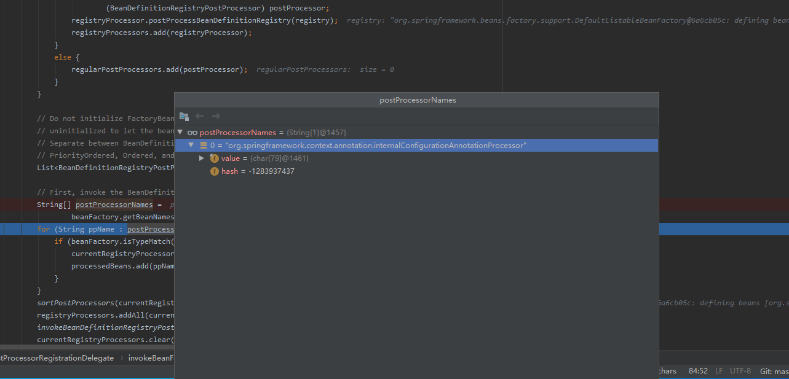
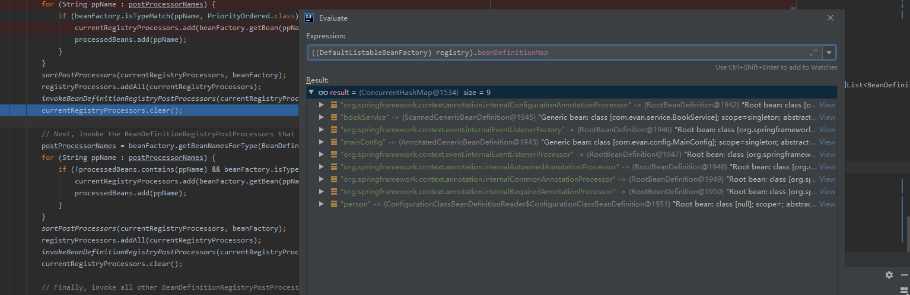
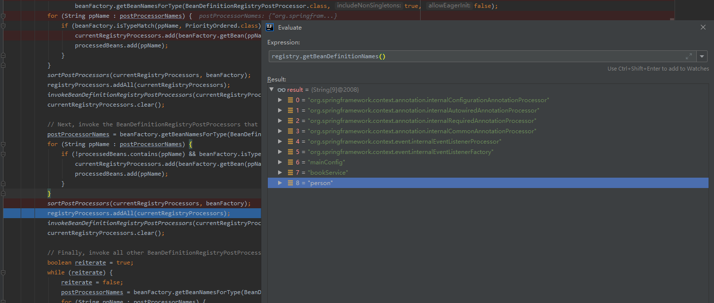
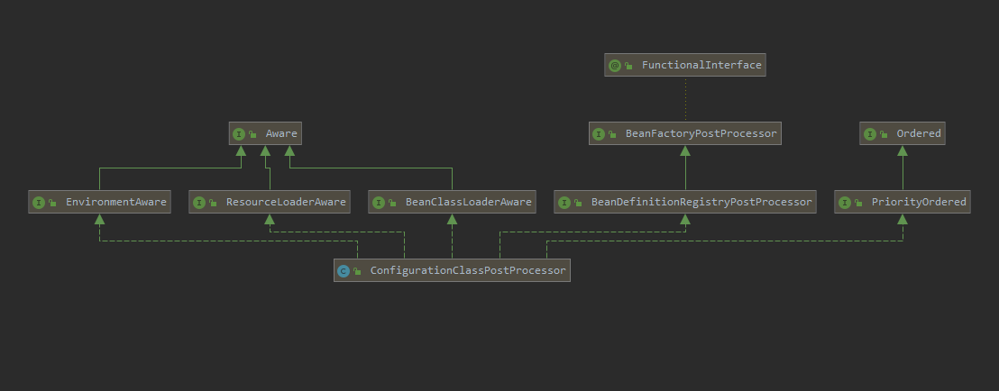
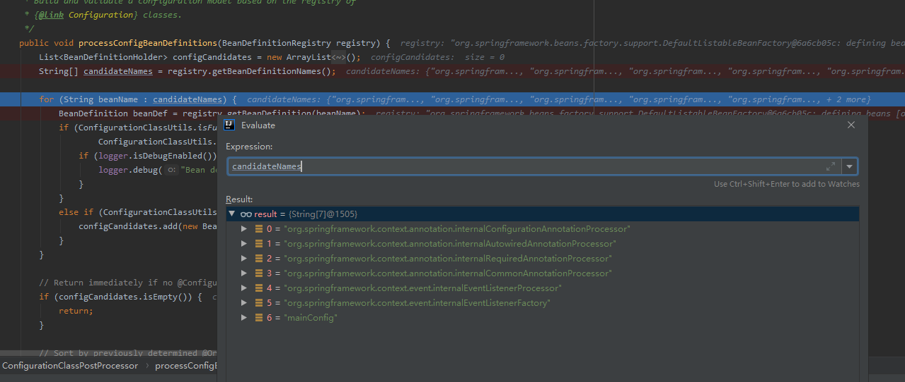
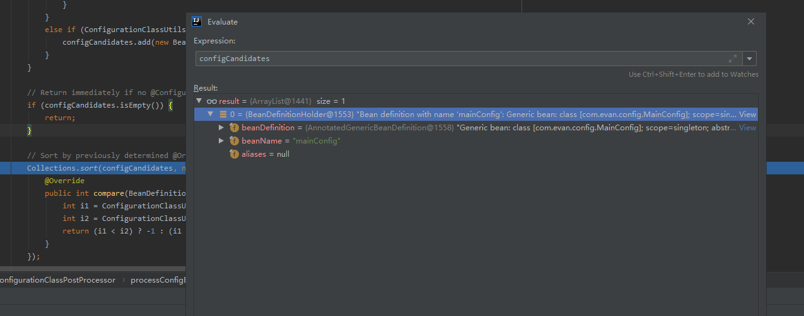
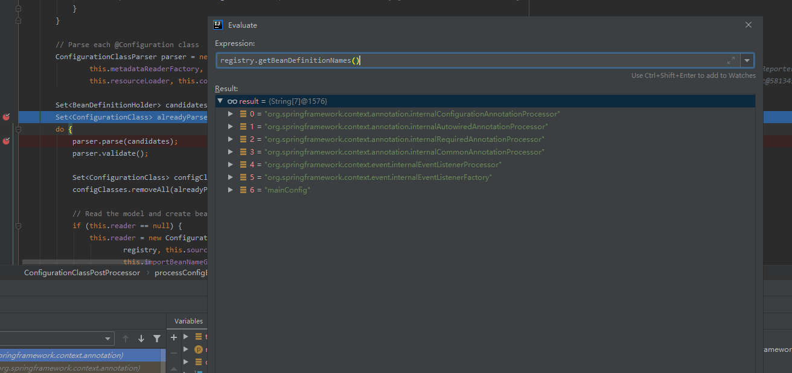
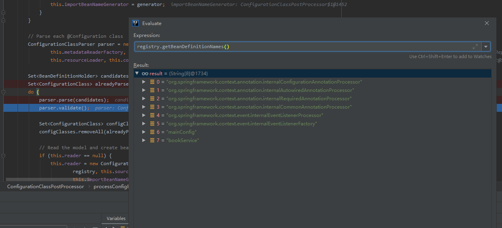

#### invokeBeanFactoryPostProcessors
```
/**
 * 在上下文中调用注册为bean的工厂处理器
 */
invokeBeanFactoryPostProcessors(beanFactory);
```

```
protected void invokeBeanFactoryPostProcessors(ConfigurableListableBeanFactory beanFactory) {

		/**
		 * getBeanFactoryPostProcessors 获取的是 this.beanFactoryPostProcessors;
		 * 何为自定义？
		 * 不通过注解形式扫描获取
		 * 而是通过手动context.addBeanFactoryPostProcessor(beanFactoryPostProcessor)完成自定义
		 *
		 * getBeanFactoryPostProcessors默认是个空的List
		 */
		PostProcessorRegistrationDelegate.invokeBeanFactoryPostProcessors(beanFactory, getBeanFactoryPostProcessors());

		// Detect a LoadTimeWeaver and prepare for weaving, if found in the meantime
		// (e.g. through an @Bean method registered by ConfigurationClassPostProcessor)
		/**
		 * 如果发现loadTimeWeaver的Bean
		 * 添加BeanPostProcessor->LoadTimeWeaverAwareProcessor
		 */
		if (beanFactory.getTempClassLoader() == null && beanFactory.containsBean(LOAD_TIME_WEAVER_BEAN_NAME)) {
			beanFactory.addBeanPostProcessor(new LoadTimeWeaverAwareProcessor(beanFactory));
			beanFactory.setTempClassLoader(new ContextTypeMatchClassLoader(beanFactory.getBeanClassLoader()));
		}
	}
```

#### getBeanFactoryPostProcessors()
getBeanFactoryPostProcessors()方法获取的是AbstractApplicationContext#beanFactoryPostProcessors这个成员变量。
这个成员变量只能通过代码中手动编码调用AbstractApplicationContext#addBeanFactoryPostProcessor方法来添加新的元素。

打个断点演示一下

空的，因为没有通过addBeanFactoryPostProcessor方法添加BFPP，需要的话可以在main函数中执行这个方法

#### PostProcessorRegistrationDelegate类
invokeBeanFactoryPostProcessors(beanFactory)方法的主要的逻辑在
PostProcessorRegistrationDelegate.invokeBeanFactoryPostProcessors方法中：


```
   	public static void invokeBeanFactoryPostProcessors(
   			ConfigurableListableBeanFactory beanFactory, List<BeanFactoryPostProcessor> beanFactoryPostProcessors) {
   
   		// Invoke BeanDefinitionRegistryPostProcessors first, if any.
   		Set<String> processedBeans = new HashSet<String>();

        if (beanFactory instanceof BeanDefinitionRegistry) {
			BeanDefinitionRegistry registry = (BeanDefinitionRegistry) beanFactory;

			/**
			 * 常规的BeanFactoryPostProcessor
			 */
			List<BeanFactoryPostProcessor> regularPostProcessors = new ArrayList<>();

			/**
			 * 实现自定义注册bean定义逻辑的BeanFactoryPostProcessor
			 */
			List<BeanDefinitionRegistryPostProcessor> registryProcessors = new ArrayList<>();

			/**
			 * beanFactoryPostProcessors默认为空
			 * 除非通过context.addBeanFactoryPostProcessor(beanFactoryPostProcessor)添加
			 */
			for (BeanFactoryPostProcessor postProcessor : beanFactoryPostProcessors) {
				if (postProcessor instanceof BeanDefinitionRegistryPostProcessor) {
					BeanDefinitionRegistryPostProcessor registryProcessor =
							(BeanDefinitionRegistryPostProcessor) postProcessor;
					registryProcessor.postProcessBeanDefinitionRegistry(registry);
					registryProcessors.add(registryProcessor);
				}
				else {
					regularPostProcessors.add(postProcessor);
				}
			}

			// Do not initialize FactoryBeans here: We need to leave all regular beans
			// uninitialized to let the bean factory post-processors apply to them!
			// Separate between BeanDefinitionRegistryPostProcessors that implement
			// PriorityOrdered, Ordered, and the rest.

			/**
			 * spring自己内部的BeanFactoryPostProcessor
			 * 不是通过context.addBeanFactoryPostProcessor(beanFactoryPostProcessor)添加的
			 */
			List<BeanDefinitionRegistryPostProcessor> currentRegistryProcessors = new ArrayList<>();

			// First, invoke the BeanDefinitionRegistryPostProcessors that implement PriorityOrdered.
			String[] postProcessorNames =
					beanFactory.getBeanNamesForType(BeanDefinitionRegistryPostProcessor.class, true, false);
			/**
			 * 这个地方得到一个BeanFactoryPostProcessor,因为是spring默认在最开始自己注册的
			 * 为什么要在最开始注册这个bean？
			 * 因为spring工厂需要去解析、扫描等功能
			 * 而这些功能都是需要在spring工厂初始化完成之前去执行
			 * 要么在工厂最开始的时候、要么在工程初始化之中，反正不能在之后
			 *
			 * 所以这里spring在一开始的时候就注册了一个BeanFactoryPostProcessor,用来插手springFactory的实例化过程
			 * 此处断点可知这个类叫做：ConfigurationAnnotationProcessor
			 */
			for (String ppName : postProcessorNames) {
				if (beanFactory.isTypeMatch(ppName, PriorityOrdered.class)) {
					currentRegistryProcessors.add(beanFactory.getBean(ppName, BeanDefinitionRegistryPostProcessor.class));
					processedBeans.add(ppName);
				}
			}
			// 排序不重要，况且这里currentRegistryProcessors只有一条数据
			sortPostProcessors(currentRegistryProcessors, beanFactory);
			// 合并List
			registryProcessors.addAll(currentRegistryProcessors);
			/**
			 * 这个方法最重要
			 * 开始循环调用BeanDefinitionRegistryPostProcessor
			 *
			 * 其中有一个spring内部的BeanDefinitionRegistryPostProcessors——>ConfigurationClassPostProcessor
			 * 处理@Configuration/@Component等注解，扫描、注册包下的类
			 * 处理@Import/@ImportResource/@Bean等...
			 */
			invokeBeanDefinitionRegistryPostProcessors(currentRegistryProcessors, registry);
			/**
			 * 清除临时变量，后面还要用这个变量
			 */
			currentRegistryProcessors.clear();

			// Next, invoke the BeanDefinitionRegistryPostProcessors that implement Ordered.
			postProcessorNames = beanFactory.getBeanNamesForType(BeanDefinitionRegistryPostProcessor.class, true, false);
			for (String ppName : postProcessorNames) {
				if (!processedBeans.contains(ppName) && beanFactory.isTypeMatch(ppName, Ordered.class)) {
					currentRegistryProcessors.add(beanFactory.getBean(ppName, BeanDefinitionRegistryPostProcessor.class));
					processedBeans.add(ppName);
				}
			}
			sortPostProcessors(currentRegistryProcessors, beanFactory);
			registryProcessors.addAll(currentRegistryProcessors);
			invokeBeanDefinitionRegistryPostProcessors(currentRegistryProcessors, registry);
			currentRegistryProcessors.clear();

			// Finally, invoke all other BeanDefinitionRegistryPostProcessors until no further ones appear.
			boolean reiterate = true;
			while (reiterate) {
				reiterate = false;
				postProcessorNames = beanFactory.getBeanNamesForType(BeanDefinitionRegistryPostProcessor.class, true, false);
				for (String ppName : postProcessorNames) {
					if (!processedBeans.contains(ppName)) {
						currentRegistryProcessors.add(beanFactory.getBean(ppName, BeanDefinitionRegistryPostProcessor.class));
						processedBeans.add(ppName);
						reiterate = true;
					}
				}
				sortPostProcessors(currentRegistryProcessors, beanFactory);
				registryProcessors.addAll(currentRegistryProcessors);
				invokeBeanDefinitionRegistryPostProcessors(currentRegistryProcessors, registry);
				currentRegistryProcessors.clear();
			}

			// Now, invoke the postProcessBeanFactory callback of all processors handled so far.
			/**
			 * 前面执行的是BeanFactoryPostProcessor的子类BeanDefinitionRegistryPostProcessor的回调
			 * 现在执行BeanFactoryPostProcessor的回调
			 */
			invokeBeanFactoryPostProcessors(registryProcessors, beanFactory);
			invokeBeanFactoryPostProcessors(regularPostProcessors, beanFactory);
		}
```


1. 首先有个判断if (beanFactory instanceof BeanDefinitionRegistry)，beanFactory 就是DefaultListableBeanFactory，它实现了BeanDefinitionRegistry，if条件成立。

2. 优先处理程序传进来的beanFactoryPostProcessors，也就是我们手动调用AbstractApplicationContext#addBeanFactoryPostProcessor方法来添加的BeanFactoryPostProcessor。
3. BeanFactoryPostProcessor是一个顶级接口，他还有一个子类BeanDefinitionRegistryPostProcessor。在该方法中声明了两个List来存放BeanFactoryPostProcessor和BeanDefinitionRegistryPostProcessor，
        以便控制这两个接口方法的执行。
   
4. 遍历传入的List<BeanFactoryPostProcessor> beanFactoryPostProcessors，将其分类放到两个List中。如果传入的是BeanDefinitionRegistryPostProcessor类，
则先执行BeanDefinitionRegistryPostProcessor类中独有的方法postProcessBeanDefinitionRegistry方法。当然，我们这里传入的List<BeanFactoryPostProcessor> beanFactoryPostProcessors为空。


```
    for (BeanFactoryPostProcessor postProcessor : beanFactoryPostProcessors) {
        if (postProcessor instanceof BeanDefinitionRegistryPostProcessor) {
            BeanDefinitionRegistryPostProcessor registryProcessor =
                    (BeanDefinitionRegistryPostProcessor) postProcessor;
            registryProcessor.postProcessBeanDefinitionRegistry(registry);
            registryProcessors.add(registryProcessor);
        }
        else {
            regularPostProcessors.add(postProcessor);
        }
    }

```

5. 第一次执行`beanFactory.getBeanNamesForType(BeanDefinitionRegistryPostProcessor.class, true, false);`方法，从容器中获取BeanDefinitionRegistryPostProcessor类型的Bean的name
（这里只是获取名称，还没有实例化Bean）。注意，程序执行到这里，Spring还没有扫描包，还没有将项目中的Bean注册到容器中。默认情况下，这里返回的数据为如下图所示
。回忆一下，这个BeanDefinition是在什么时候被加入到BeanFactory的呢？是在AnnotationConfigApplicationContext的无参构造器中创建reader时注册的BeanDefinition。
其中BeanName为`org.springframework.context.annotation.internalConfigurationAnnotationProcessor`，对应的Class为`org.springframework.context.annotation.ConfigurationClassPostProcessor`。




6. 遍历这个获取的postProcessorNames，如果实现了PriorityOrdered接口，就调用beanFactory.getBean(ppName, BeanDefinitionRegistryPostProcessor.class)方法，
从容器中获取这个Bean，将其加入到临时变量List<BeanDefinitionRegistryPostProcessor> currentRegistryProcessors中。
   
7. 对currentRegistryProcessors中的元素进行排序，然后执行BeanDefinitionRegistryPostProcessor中的特有方法postProcessBeanDefinitionRegistry。注意哦，这里没有执行其父类的方法，而是又将其放到List<BeanDefinitionRegistryPostProcessor> registryProcessors中，到后面再执行其父类方法。
    ```
    invokeBeanDefinitionRegistryPostProcessors(currentRegistryProcessors, registry);                                                                 
    ```
8. 默认情况下，此时currentRegistryProcessors中只有一个Bean即：`org.springframework.context.annotation.ConfigurationClassPostProcessor`（它实现了PriorityOrdered接口）。
`ConfigurationClassPostProcessor`是一个非常重要的类。当程序执行完`ConfigurationClassPostProcessor`的`BeanDefinitionRegistryPostProcessor`方法后，
我们程序中的Bean就被注册到了Spring容器中了，需要注意的是，这里还只是注册了BeanDefinition，还没有创建Bean对象。
   


9. 当第二次执行postProcessorNames = beanFactory.getBeanNamesForType(BeanDefinitionRegistryPostProcessor.class, true, false);方法，此时因为之前已经完成了Bean的扫描，所以如果我们有自定义的BeanDefinitionRegistryPostProcessor就可以在这里被获取了。获取之前，判断其是否实现Ordered接口，并且之前没有被执行过，则调用getBean方法，从容器中获取该Bean，然后进行排序，执行postProcessBeanDefinitionRegistry方法。



10. 前面已经按顺序执行了实现PriorityOrdered 和Ordered接口的BeanDefinitionRegistryPostProcessor，最后，执行没有实现Ordered接口的BeanDefinitionRegistryPostProcessor的postProcessBeanDefinitionRegistry方法。执行完之后再BeanDefinitionRegistryPostProcessor的父类方法postProcessBeanFactory。


11. 获取容器中还没有被执行过的实现BeanFactoryPostProcessor接口的Bean，然后按顺序执行的postProcessBeanFactory。默认情况下，这里会获取到：


由于Bean org.springframework.context.annotation.internalConfigurationAnnotationProcessor（对应的Class为org.springframework.context.annotation.ConfigurationClassPostProcessor）在之前已经被执行了，这里只会执行Bean org.springframework.context.event.internalEventListenerProcessor（对应的Class为org.springframework.context.event.EventListenerMethodProcessor）的postProcessBeanFactory方法，源码如下：

```
//org.springframework.context.event.EventListenerMethodProcessor#postProcessBeanFactory 源码
@Override
public void postProcessBeanFactory(ConfigurableListableBeanFactory beanFactory) {
	this.beanFactory = beanFactory;

	Map<String, EventListenerFactory> beans = beanFactory.getBeansOfType(EventListenerFactory.class, false, false);
	List<EventListenerFactory> factories = new ArrayList<>(beans.values());
	AnnotationAwareOrderComparator.sort(factories);
	this.eventListenerFactories = factories;
}

```
---


在创建AnnotationConfigApplicationContext对象时Spring就添加了一个非常重要的BeanFactoryPostProcessor接口实现类：ConfigurationClassPostProcessor。
注意，这里说的添加只是添加到容器的beanDefinitionMap中，还没有创建真正的实例Bean。

简单回顾一下ConfigurationClassPostProcessor是在什么时候被添加到容器中的：在AnnotationConfigApplicationContext的无参构造器中创建AnnotatedBeanDefinitionReader对象时会向传入的BeanDefinitionRegistry中
注册解析注解配置类相关的processors的BeanDefinition，ConfigurationClassPostProcessor就是在此处被添加到容器中的。


```
public static Set<BeanDefinitionHolder> registerAnnotationConfigProcessors(
        BeanDefinitionRegistry registry, Object source) {
 
    ....    

    if (!registry.containsBeanDefinition(CONFIGURATION_ANNOTATION_PROCESSOR_BEAN_NAME)) {
        RootBeanDefinition def = new RootBeanDefinition(ConfigurationClassPostProcessor.class);
        def.setSource(source);
        beanDefs.add(registerPostProcessor(registry, def, CONFIGURATION_ANNOTATION_PROCESSOR_BEAN_NAME));
    }

    ...

```
---
#### ConfigurationClassPostProcessor

先看一些ConfigurationClassPostProcessor的继承体系：





ConfigurationClassPostProcessor实现了BeanDefinitionRegistryPostProcessor接口，也就拥有了在Spring容器启动时，往容器中注册BeanDefinition的能力。
我们知道，ConfigurationClassPostProcessor#postProcessBeanDefinitionRegistry方法是在refresh();方法中的invokeBeanFactoryPostProcessors(beanFactory);中被执行的，下面我们就一起来看一下该方法。


##### ConfigurationClassPostProcessor#postProcessBeanDefinitionRegistry

```
	/**
	 * Derive further bean definitions from the configuration classes in the registry.
	 */
	@Override
	public void postProcessBeanDefinitionRegistry(BeanDefinitionRegistry registry) {
		int registryId = System.identityHashCode(registry);
		if (this.registriesPostProcessed.contains(registryId)) {
			throw new IllegalStateException(
					"postProcessBeanDefinitionRegistry already called on this post-processor against " + registry);
		}
		if (this.factoriesPostProcessed.contains(registryId)) {
			throw new IllegalStateException(
					"postProcessBeanFactory already called on this post-processor against " + registry);
		}
		this.registriesPostProcessed.add(registryId);

		processConfigBeanDefinitions(registry);
	}
```
主要的逻辑在processConfigBeanDefinitions(registry);中，点开源码：
```
	/**
	 * Build and validate a configuration model based on the registry of
	 * {@link Configuration} classes.
	 */
	public void processConfigBeanDefinitions(BeanDefinitionRegistry registry) {
		List<BeanDefinitionHolder> configCandidates = new ArrayList<BeanDefinitionHolder>();
        
        // 获取所有的BeanDefinitionName
		String[] candidateNames = registry.getBeanDefinitionNames();

		for (String beanName : candidateNames) {
			BeanDefinition beanDef = registry.getBeanDefinition(beanName);
			if (ConfigurationClassUtils.isFullConfigurationClass(beanDef) ||
					ConfigurationClassUtils.isLiteConfigurationClass(beanDef)) {
				if (logger.isDebugEnabled()) {
					logger.debug("Bean definition has already been processed as a configuration class: " + beanDef);
				}
			}
            // 校验是否为配置类
            // 配置类分为两种 Full @Configuration vs “lite” @Bean mode
            // 校验之后在 BeanDefinition 中添加标志属性
            // 如果满足条件则加入到configCandidates
			else if (ConfigurationClassUtils.checkConfigurationClassCandidate(beanDef, this.metadataReaderFactory)) {
				configCandidates.add(new BeanDefinitionHolder(beanDef, beanName));
			}
		}

		// Return immediately if no @Configuration classes were found
		if (configCandidates.isEmpty()) {
			return;
		}

		// Sort by previously determined @Order value, if applicable
		Collections.sort(configCandidates, new Comparator<BeanDefinitionHolder>() {
			@Override
			public int compare(BeanDefinitionHolder bd1, BeanDefinitionHolder bd2) {
				int i1 = ConfigurationClassUtils.getOrder(bd1.getBeanDefinition());
				int i2 = ConfigurationClassUtils.getOrder(bd2.getBeanDefinition());
				return (i1 < i2) ? -1 : (i1 > i2) ? 1 : 0;
			}
		});

		// Detect any custom bean name generation strategy supplied through the enclosing application context
		SingletonBeanRegistry sbr = null;
        // 传入的 registry 是 DefaultListableBeanFactory
		if (registry instanceof SingletonBeanRegistry) {
			sbr = (SingletonBeanRegistry) registry;
			if (!this.localBeanNameGeneratorSet && sbr.containsSingleton(CONFIGURATION_BEAN_NAME_GENERATOR)) {
                //获取自定义BeanNameGenerator,一般情况下为空
				BeanNameGenerator generator = (BeanNameGenerator) sbr.getSingleton(CONFIGURATION_BEAN_NAME_GENERATOR);
				this.componentScanBeanNameGenerator = generator;
				this.importBeanNameGenerator = generator;
			}
		}

		// Parse each @Configuration class
        // new ConfigurationClassParser,用来解析 @Configuration 类
		ConfigurationClassParser parser = new ConfigurationClassParser(
				this.metadataReaderFactory, this.problemReporter, this.environment,
				this.resourceLoader, this.componentScanBeanNameGenerator, registry);

        // 将 configCandidates 转成 set  candidates , 去重
		Set<BeanDefinitionHolder> candidates = new LinkedHashSet<BeanDefinitionHolder>(configCandidates);
		Set<ConfigurationClass> alreadyParsed = new HashSet<ConfigurationClass>(configCandidates.size());
		do {
            // 该方法负责解析配置类、扫描包、注册BeanDefinition
			parser.parse(candidates);
			parser.validate();

			Set<ConfigurationClass> configClasses = new LinkedHashSet<ConfigurationClass>(parser.getConfigurationClasses());
			configClasses.removeAll(alreadyParsed);

			// Read the model and create bean definitions based on its content
			if (this.reader == null) {
				this.reader = new ConfigurationClassBeanDefinitionReader(
						registry, this.sourceExtractor, this.resourceLoader, this.environment,
						this.importBeanNameGenerator, parser.getImportRegistry());
			}
            // Import类,@Bean,@ImportResource 转化为 BeanDefinition
			this.reader.loadBeanDefinitions(configClasses);
			alreadyParsed.addAll(configClasses);

			candidates.clear();
            // 再获取一下容器中BeanDefinition的数据,如果发现数量增加了,说明有新的BeanDefinition被注册了
			if (registry.getBeanDefinitionCount() > candidateNames.length) {
				String[] newCandidateNames = registry.getBeanDefinitionNames();
				Set<String> oldCandidateNames = new HashSet<String>(Arrays.asList(candidateNames));
				Set<String> alreadyParsedClasses = new HashSet<String>();
				for (ConfigurationClass configurationClass : alreadyParsed) {
					alreadyParsedClasses.add(configurationClass.getMetadata().getClassName());
				}
				for (String candidateName : newCandidateNames) {
					if (!oldCandidateNames.contains(candidateName)) {
						BeanDefinition bd = registry.getBeanDefinition(candidateName);
						if (ConfigurationClassUtils.checkConfigurationClassCandidate(bd, this.metadataReaderFactory) &&
								!alreadyParsedClasses.contains(bd.getBeanClassName())) {
							candidates.add(new BeanDefinitionHolder(bd, candidateName));
						}
					}
				}
				candidateNames = newCandidateNames;
			}
		}
		while (!candidates.isEmpty());

		// Register the ImportRegistry as a bean in order to support ImportAware @Configuration classes
		if (sbr != null) {
			if (!sbr.containsSingleton(IMPORT_REGISTRY_BEAN_NAME)) {
				sbr.registerSingleton(IMPORT_REGISTRY_BEAN_NAME, parser.getImportRegistry());
			}
		}

		if (this.metadataReaderFactory instanceof CachingMetadataReaderFactory) {
			((CachingMetadataReaderFactory) this.metadataReaderFactory).clearCache();
		}
	}
```

获取所有的BeanDefinitionNames，然后循环这个数组，判断其是否为配置类。



前5个是Spring注册的内置processor，最后一个是传入给AnnotationConfigApplicationContext的配置类mainConfig.class。

在Spring中存在两种ConfigurationClass，一种是FullConfigurationClass另一种是LiteConfigurationClass。

ConfigurationClassUtils#checkConfigurationClassCandidate方法内部就是在判断属于哪种配置类，并在BeanDefinition中标记判断结果。其具体的判断逻辑如下：

```
abstract class ConfigurationClassUtils {

	private static final String CONFIGURATION_CLASS_FULL = "full";

	private static final String CONFIGURATION_CLASS_LITE = "lite";

	private static final String CONFIGURATION_CLASS_ATTRIBUTE =
			Conventions.getQualifiedAttributeName(ConfigurationClassPostProcessor.class, "configurationClass");

	private static final String ORDER_ATTRIBUTE =
			Conventions.getQualifiedAttributeName(ConfigurationClassPostProcessor.class, "order");


	private static final Log logger = LogFactory.getLog(ConfigurationClassUtils.class);

	private static final Set<String> candidateIndicators = new HashSet<String>(4);

	static {
		candidateIndicators.add(Component.class.getName());
		candidateIndicators.add(ComponentScan.class.getName());
		candidateIndicators.add(Import.class.getName());
		candidateIndicators.add(ImportResource.class.getName());
	}

	/**
	 * Determine whether the given bean definition indicates a full {@code @Configuration}
	 * class, through checking {@link #checkConfigurationClassCandidate}'s metadata marker.
	 */
	public static boolean isFullConfigurationClass(BeanDefinition beanDef) {
		return CONFIGURATION_CLASS_FULL.equals(beanDef.getAttribute(CONFIGURATION_CLASS_ATTRIBUTE));
	}

	/**
	 * Determine whether the given bean definition indicates a lite {@code @Configuration}
	 * class, through checking {@link #checkConfigurationClassCandidate}'s metadata marker.
	 */
	public static boolean isLiteConfigurationClass(BeanDefinition beanDef) {
		return CONFIGURATION_CLASS_LITE.equals(beanDef.getAttribute(CONFIGURATION_CLASS_ATTRIBUTE));
	}

```

判断configCandidates变量中存放的

配置类是否为空，如果不为空，则对其进行排序。




创建ConfigurationClassParser对象，用于解析@Configuration类，完成包的扫描、BeanDefinition的注册。主要通过执行parser.parse(candidates);方法来完成。

执行parser.parse(candidates)方法前 ：



执行parser.parse(candidates)方法后 ：

解析完配置类之后，紧接着又执行了this.reader.loadBeanDefinitions(configClasses);方法。这个方法主要是用来处理Import类、@Bean和@ImportResource注解。

最后又加了入了对ImportAware接口支持所需要的Bean。
```
// Register the ImportRegistry as a bean in order to support ImportAware @Configuration classes
if (sbr != null && !sbr.containsSingleton(IMPORT_REGISTRY_BEAN_NAME)) {
	sbr.registerSingleton(IMPORT_REGISTRY_BEAN_NAME, parser.getImportRegistry());
}
```


---
#### ConfigurationClassParser 解析配置类

在ConfigurationClassPostProcessor#processConfigBeanDefinitions方法中创建了ConfigurationClassParser对象并调用其parse方法。该方法就是在负责解析配置类、扫描包、注册BeanDefinition，源码如下：

```
	public void parse(Set<BeanDefinitionHolder> configCandidates) {
		this.deferredImportSelectors = new LinkedList<DeferredImportSelectorHolder>();

		for (BeanDefinitionHolder holder : configCandidates) {
			BeanDefinition bd = holder.getBeanDefinition();
			try {
                // 根据不同的 BeanDefinition 实例对象 调用不同的 parse 方法
			    // 底层其实都是在调用 org.springframework.context.annotation.ConfigurationClassParser.processConfigurationClass
				if (bd instanceof AnnotatedBeanDefinition) {
					parse(((AnnotatedBeanDefinition) bd).getMetadata(), holder.getBeanName());
				}
				else if (bd instanceof AbstractBeanDefinition && ((AbstractBeanDefinition) bd).hasBeanClass()) {
					parse(((AbstractBeanDefinition) bd).getBeanClass(), holder.getBeanName());
				}
				else {
					parse(bd.getBeanClassName(), holder.getBeanName());
				}
			}
			catch (BeanDefinitionStoreException ex) {
				throw ex;
			}
			catch (Throwable ex) {
				throw new BeanDefinitionStoreException(
						"Failed to parse configuration class [" + bd.getBeanClassName() + "]", ex);
			}
		}
        // 执行DeferredImportSelector
		processDeferredImportSelectors();
	}
```

在该方法内部根据不同的BeanDefinition实例对象，调用了不同的parse方法，而这些parse方法底层，实际上都是调用了ConfigurationClassParser#processConfigurationClass方法。

```
protected void processConfigurationClass(ConfigurationClass configClass) throws IOException {
	// 是否需要跳过 @Conditional
	if (this.conditionEvaluator.shouldSkip(configClass.getMetadata(), ConfigurationPhase.PARSE_CONFIGURATION)) {
		return;
	}

	// 第一次进入的时候, configurationClasses size = 0,existingClass 肯定为 null
	ConfigurationClass existingClass = this.configurationClasses.get(configClass);
	if (existingClass != null) {
		if (configClass.isImported()) {
			if (existingClass.isImported()) {
				existingClass.mergeImportedBy(configClass);
			}
			// Otherwise ignore new imported config class; existing non-imported class overrides it.
			return;
		} else {
			// Explicit bean definition found, probably replacing an import.
			// Let's remove the old one and go with the new one.
			this.configurationClasses.remove(configClass);
			this.knownSuperclasses.values().removeIf(configClass::equals);
		}
	}

	// Recursively process the configuration class and its superclass hierarchy.
	SourceClass sourceClass = asSourceClass(configClass);
	do {
		// 真正的做解析
		sourceClass = doProcessConfigurationClass(configClass, sourceClass);
	}
	while (sourceClass != null);

	this.configurationClasses.put(configClass, configClass);
}
```

方法传入的ConfigurationClass对象是对配置类的封装。首先判断配置类上是否有@Conditional注解，是否需要跳过解析该配置类。


然后，调用doProcessConfigurationClass(configClass, sourceClass);做真正的解析。其中，configClass是程序的配置类，而sourceClass是通过configClass创建的。

```
protected final SourceClass doProcessConfigurationClass(ConfigurationClass configClass, SourceClass sourceClass)
		throws IOException {

	// @Configuration 继承了 @Component
	if (configClass.getMetadata().isAnnotated(Component.class.getName())) {
		// Recursively process any member (nested) classes first
		// 递归处理内部类
		processMemberClasses(configClass, sourceClass);
	}

	// Process any @PropertySource annotations
	// 处理@PropertySource
	// @PropertySource注解用来加载properties文件
	for (AnnotationAttributes propertySource : AnnotationConfigUtils.attributesForRepeatable(
			sourceClass.getMetadata(), PropertySources.class,
			org.springframework.context.annotation.PropertySource.class)) {
		if (this.environment instanceof ConfigurableEnvironment) {
			processPropertySource(propertySource);
		} else {
			logger.info("Ignoring @PropertySource annotation on [" + sourceClass.getMetadata().getClassName() +
					"]. Reason: Environment must implement ConfigurableEnvironment");
		}
	}

	// Process any @ComponentScan annotations
	Set<AnnotationAttributes> componentScans = AnnotationConfigUtils.attributesForRepeatable(
			sourceClass.getMetadata(), ComponentScans.class, ComponentScan.class);
	if (!componentScans.isEmpty() &&
			!this.conditionEvaluator.shouldSkip(sourceClass.getMetadata(), ConfigurationPhase.REGISTER_BEAN)) {
		for (AnnotationAttributes componentScan : componentScans) {
			// The config class is annotated with @ComponentScan -> perform the scan immediately
			Set<BeanDefinitionHolder> scannedBeanDefinitions =
					this.componentScanParser.parse(componentScan, sourceClass.getMetadata().getClassName());
			// Check the set of scanned definitions for any further config classes and parse recursively if needed
			for (BeanDefinitionHolder holder : scannedBeanDefinitions) {
				BeanDefinition bdCand = holder.getBeanDefinition().getOriginatingBeanDefinition();
				if (bdCand == null) {
					bdCand = holder.getBeanDefinition();
				}
				//判断解析获取的 BeanDefinition 中 是否有配置类
				// 这里的配置类包括FullConfigurationClass和LiteConfigurationClass
				// 也就是说只要有@Configuration、@Component、@ComponentScan、@Import、@ImportResource和@Bean中的其中一个注解
				if (ConfigurationClassUtils.checkConfigurationClassCandidate(bdCand, this.metadataReaderFactory)) {
					//如果有配置类,递归调用,解析该配置类,这个if几乎都为true，这个方法几乎都要执行
					parse(bdCand.getBeanClassName(), holder.getBeanName());
				}
			}
		}
	}

	// Process any @Import annotations
	processImports(configClass, sourceClass, getImports(sourceClass), true);

	// Process any @ImportResource annotations
	AnnotationAttributes importResource =
			AnnotationConfigUtils.attributesFor(sourceClass.getMetadata(), ImportResource.class);
	if (importResource != null) {
		String[] resources = importResource.getStringArray("locations");
		Class<? extends BeanDefinitionReader> readerClass = importResource.getClass("reader");
		for (String resource : resources) {
			String resolvedResource = this.environment.resolveRequiredPlaceholders(resource);
			configClass.addImportedResource(resolvedResource, readerClass);
		}
	}

	// Process individual @Bean methods
	//处理单个@Bean的方法
	Set<MethodMetadata> beanMethods = retrieveBeanMethodMetadata(sourceClass);
	for (MethodMetadata methodMetadata : beanMethods) {
		configClass.addBeanMethod(new BeanMethod(methodMetadata, configClass));
	}

	// Process default methods on interfaces
	processInterfaces(configClass, sourceClass);

	// Process superclass, if any
	if (sourceClass.getMetadata().hasSuperClass()) {
		String superclass = sourceClass.getMetadata().getSuperClassName();
		if (superclass != null && !superclass.startsWith("java") &&
				!this.knownSuperclasses.containsKey(superclass)) {
			this.knownSuperclasses.put(superclass, configClass);
			// Superclass found, return its annotation metadata and recurse
			return sourceClass.getSuperClass();
		}
	}

	// No superclass -> processing is complete
	return null;
}

```


##### 解析内部类
配置类上有@Configuration注解，该注解继承 @Component，if 判断为true，调用processMemberClasses方法，递归解析配置类中的内部类。
##### 解析@PropertySource注解
如果配置类上有@PropertySource注解，则解析加载properties文件，并将属性添加到Spring上下文中。((ConfigurableEnvironment) this.environment).getPropertySources().addFirstPropertySource(newSource);。

##### 处理@ComponentScan注解
获取配置类上的@ComponentScan注解，判断是否需要跳过。循环所有的ComponentScan，立即执行扫描。ComponentScanAnnotationParser#parse方法如下：

```
public Set<BeanDefinitionHolder> parse(AnnotationAttributes componentScan, final String declaringClass) {
	// 创建 ClassPathBeanDefinitionScanner
	// 在 AnnotationConfigApplicationContext 的构造器中也创建了一个ClassPathBeanDefinitionScanner
	// 这里证明了,执行扫描 scanner 不是构造器中的,而是这里创建的
	ClassPathBeanDefinitionScanner scanner = new ClassPathBeanDefinitionScanner(this.registry,
			componentScan.getBoolean("useDefaultFilters"), this.environment, this.resourceLoader);

	// @ComponentScan 中可以注册自定义的 BeanNameGenerator
	// 但是需要注意,通过源码可以明白,这里注册的自定义BeanNameGenerator 只对当前 scanner 有效
	Class<? extends BeanNameGenerator> generatorClass = componentScan.getClass("nameGenerator");
	boolean useInheritedGenerator = (BeanNameGenerator.class == generatorClass);
	scanner.setBeanNameGenerator(useInheritedGenerator ? this.beanNameGenerator :
			BeanUtils.instantiateClass(generatorClass));

	ScopedProxyMode scopedProxyMode = componentScan.getEnum("scopedProxy");
	if (scopedProxyMode != ScopedProxyMode.DEFAULT) {
		scanner.setScopedProxyMode(scopedProxyMode);
	} else {
		Class<? extends ScopeMetadataResolver> resolverClass = componentScan.getClass("scopeResolver");
		scanner.setScopeMetadataResolver(BeanUtils.instantiateClass(resolverClass));
	}

	scanner.setResourcePattern(componentScan.getString("resourcePattern"));

	for (AnnotationAttributes filter : componentScan.getAnnotationArray("includeFilters")) {
		for (TypeFilter typeFilter : typeFiltersFor(filter)) {
			scanner.addIncludeFilter(typeFilter);
		}
	}
	for (AnnotationAttributes filter : componentScan.getAnnotationArray("excludeFilters")) {
		for (TypeFilter typeFilter : typeFiltersFor(filter)) {
			scanner.addExcludeFilter(typeFilter);
		}
	}

	boolean lazyInit = componentScan.getBoolean("lazyInit");
	if (lazyInit) {
		scanner.getBeanDefinitionDefaults().setLazyInit(true);
	}

	Set<String> basePackages = new LinkedHashSet<>();
	String[] basePackagesArray = componentScan.getStringArray("basePackages");
	for (String pkg : basePackagesArray) {
		String[] tokenized = StringUtils.tokenizeToStringArray(this.environment.resolvePlaceholders(pkg),
				ConfigurableApplicationContext.CONFIG_LOCATION_DELIMITERS);
		Collections.addAll(basePackages, tokenized);
	}

	// @ComponentScan(basePackageClasses = Xx.class)
	// 可以指定basePackageClasses, 只要是与是这几个类所在包及其子包,就可以被Spring扫描
	// 经常会用一个空的类来作为basePackageClasses,默认取当前配置类所在包及其子包
	for (Class<?> clazz : componentScan.getClassArray("basePackageClasses")) {
		basePackages.add(ClassUtils.getPackageName(clazz));
	}
	if (basePackages.isEmpty()) {
		basePackages.add(ClassUtils.getPackageName(declaringClass));
	}

	scanner.addExcludeFilter(new AbstractTypeHierarchyTraversingFilter(false, false) {
		@Override
		protected boolean matchClassName(String className) {
			return declaringClass.equals(className);
		}
	});

	//执行扫描
	return scanner.doScan(StringUtils.toStringArray(basePackages));
}
```

挑一些我觉得是重点的地方记录一下：

1. parse方法中新创建了一个ClassPathBeanDefinitionScanner对象，而在 AnnotationConfigApplicationContext 的构造器中也创建了一个ClassPathBeanDefinitionScanner对象，这里证实了在Spring内部，真正执行扫描的不是AnnotationConfigApplicationContext中的scanner。
2. 通过源码可以了解到，在@ComponentScan中是可以注册自定义的 BeanNameGenerator的，而这个BeanNameGenerator只对当前scanner有效。也就是说，这个BeanNameGenerator只能影响通过该scanner扫描的路径下的bean的BeanName生成规则。
3. 最后调用scanner.doScan(StringUtils.toStringArray(basePackages));方法执行真正的扫描，方法返回扫描获取到的BeanDefinition。

检验获得的BeanDefinition中是否有配置类
检验扫描获得的BeanDefinition中是否有配置类，如果有配置类，这里的配置类包括FullConfigurationClass和LiteConfigurationClass。（也就是说只要有@Configuration、@Component、@ComponentScan、@Import、@ImportResource和@Bean中的其中一个注解），则递归调用parse方法，进行解析。

##### 解析 @Import 注解
```
processImports(configClass, sourceClass, getImports(sourceClass), true);
```
processImports方法负责对@Import注解进行解析。configClass是配置类，sourceClass又是通过configClass创建的，getImports(sourceClass)从sourceClass获取所有的@Import注解信息，然后调用ConfigurationClassParser#processImports。


```
// ConfigurationClassParser#processImports 源码
	private void processImports(ConfigurationClass configClass, SourceClass currentSourceClass,
			Collection<SourceClass> importCandidates, boolean checkForCircularImports) throws IOException {

		if (importCandidates.isEmpty()) {
			return;
		}

		if (checkForCircularImports && isChainedImportOnStack(configClass)) {
			this.problemReporter.error(new CircularImportProblem(configClass, this.importStack));
		}
		else {
			this.importStack.push(configClass);
			try {
	            // importCandidates是@Import的封装
			    // 循环importCandidates对import的内容进行分类     
				for (SourceClass candidate : importCandidates) {
				    // import导入实现ImportSelector接口的类
					if (candidate.isAssignable(ImportSelector.class)) {
						// Candidate class is an ImportSelector -> delegate to it to determine imports
						Class<?> candidateClass = candidate.loadClass();
					    // 反射创建这个类的实例对象
						ImportSelector selector = BeanUtils.instantiateClass(candidateClass, ImportSelector.class);
    					//是否有实现相关Aware接口,如果有,这调用相关方法
						ParserStrategyUtils.invokeAwareMethods(
								selector, this.environment, this.resourceLoader, this.registry);
                        // 延迟加载的ImportSelector
						if (this.deferredImportSelectors != null && selector instanceof DeferredImportSelector) {
                            //  延迟加载的ImportSelector先放到List中,延迟加载
							this.deferredImportSelectors.add(
									new DeferredImportSelectorHolder(configClass, (DeferredImportSelector) selector));
						}
						else {
						    // 普通的ImportSelector ,执行其selectImports方法,获取需要导入的类的全限定类名数组
							String[] importClassNames = selector.selectImports(currentSourceClass.getMetadata());
							Collection<SourceClass> importSourceClasses = asSourceClasses(importClassNames);
                            // 递归调用 
							processImports(configClass, currentSourceClass, importSourceClasses, false);
						}
					}
                    // 是否为ImportBeanDefinitionRegistrar
					else if (candidate.isAssignable(ImportBeanDefinitionRegistrar.class)) {
						// Candidate class is an ImportBeanDefinitionRegistrar ->
						// delegate to it to register additional bean definitions
						Class<?> candidateClass = candidate.loadClass();
						ImportBeanDefinitionRegistrar registrar =
								BeanUtils.instantiateClass(candidateClass, ImportBeanDefinitionRegistrar.class);
						ParserStrategyUtils.invokeAwareMethods(
								registrar, this.environment, this.resourceLoader, this.registry);
                        // 添加到成员变量 org.springframework.context.annotation.ConfigurationClass.importBeanDefinitionRegistrars 中
						configClass.addImportBeanDefinitionRegistrar(registrar, currentSourceClass.getMetadata());
					}
					else {
						// Candidate class not an ImportSelector or ImportBeanDefinitionRegistrar ->
						// process it as an @Configuration class
                        // 普通 @Configuration class
						this.importStack.registerImport(
								currentSourceClass.getMetadata(), candidate.getMetadata().getClassName());
						// 解析导入的@Configuration class
                        processConfigurationClass(candidate.asConfigClass(configClass));
					}
				}
			}
			catch (BeanDefinitionStoreException ex) {
				throw ex;
			}
			catch (Throwable ex) {
				throw new BeanDefinitionStoreException(
						"Failed to process import candidates for configuration class [" +
						configClass.getMetadata().getClassName() + "]", ex);
			}
			finally {
				this.importStack.pop();
			}
		}
	}


private void processImports(ConfigurationClass configClass, SourceClass currentSourceClass,
							Collection<SourceClass> importCandidates, boolean checkForCircularImports) {

	if (importCandidates.isEmpty()) {
		return;
	}


	if (checkForCircularImports && isChainedImportOnStack(configClass)) {
		this.problemReporter.error(new CircularImportProblem(configClass, this.importStack));
	} else {
		this.importStack.push(configClass);
		try {
			// importCandidates是@Import的封装
			// 循环importCandidates对import的内容进行分类
			for (SourceClass candidate : importCandidates) {
				// import导入实现ImportSelector接口的类
				if (candidate.isAssignable(ImportSelector.class)) {
					// Candidate class is an ImportSelector -> delegate to it to determine imports
					Class<?> candidateClass = candidate.loadClass();
					// 反射创建这个类的实例对象
					ImportSelector selector = BeanUtils.instantiateClass(candidateClass, ImportSelector.class);
					//是否有实现相关Aware接口,如果有,这调用相关方法
					ParserStrategyUtils.invokeAwareMethods(
							selector, this.environment, this.resourceLoader, this.registry);
					// 延迟加载的ImportSelector
					if (selector instanceof DeferredImportSelector) {
						//  延迟加载的ImportSelector先放到List中,延迟加载
						this.deferredImportSelectorHandler.handle(configClass, (DeferredImportSelector) selector);
					} else {
						// 普通的ImportSelector ,执行其selectImports方法,获取需要导入的类的全限定类名数组
						String[] importClassNames = selector.selectImports(currentSourceClass.getMetadata());
						Collection<SourceClass> importSourceClasses = asSourceClasses(importClassNames);
						// 递归调用
						processImports(configClass, currentSourceClass, importSourceClasses, false);
					}
					// 是否为ImportBeanDefinitionRegistrar
				} else if (candidate.isAssignable(ImportBeanDefinitionRegistrar.class)) {
					// Candidate class is an ImportBeanDefinitionRegistrar ->
					// delegate to it to register additional bean definitions
					Class<?> candidateClass = candidate.loadClass();
					ImportBeanDefinitionRegistrar registrar =
							BeanUtils.instantiateClass(candidateClass, ImportBeanDefinitionRegistrar.class);
					ParserStrategyUtils.invokeAwareMethods(
							registrar, this.environment, this.resourceLoader, this.registry);
					// 添加到成员变量 org.springframework.context.annotation.ConfigurationClass.importBeanDefinitionRegistrars 中
					configClass.addImportBeanDefinitionRegistrar(registrar, currentSourceClass.getMetadata());
				} else {
					// Candidate class not an ImportSelector or ImportBeanDefinitionRegistrar ->
					// process it as an @Configuration class
					// 普通 @Configuration class
					this.importStack.registerImport(
							currentSourceClass.getMetadata(), candidate.getMetadata().getClassName());
					// 解析导入的@Configuration class
					processConfigurationClass(candidate.asConfigClass(configClass));
				}
			}
		} catch (BeanDefinitionStoreException ex) {
			throw ex;
		} catch (Throwable ex) {
			throw new BeanDefinitionStoreException(
					"Failed to process import candidates for configuration class [" +
							configClass.getMetadata().getClassName() + "]", ex);
		} finally {
			this.importStack.pop();
		}
	}
}
```
##### 解析 @ImportResource 注解
@ImportResource注解可以导入xml配置文件。
```
AnnotationAttributes importResource =
		AnnotationConfigUtils.attributesFor(sourceClass.getMetadata(), ImportResource.class);
if (importResource != null) {
	String[] resources = importResource.getStringArray("locations");
	Class<? extends BeanDefinitionReader> readerClass = importResource.getClass("reader");
	for (String resource : resources) {
		String resolvedResource = this.environment.resolveRequiredPlaceholders(resource);
		configClass.addImportedResource(resolvedResource, readerClass);
	}
}
```

##### 解析@Bean方法

```
Set<MethodMetadata> beanMethods = retrieveBeanMethodMetadata(sourceClass);
for (MethodMetadata methodMetadata : beanMethods) {
	configClass.addBeanMethod(new BeanMethod(methodMetadata, configClass));
}
```

将@Bean方法转化为BeanMethod对象，添加到ConfigurationClass#beanMethods集合中。
##### 如果有父类，则解析父类
```
if (sourceClass.getMetadata().hasSuperClass()) {
	String superclass = sourceClass.getMetadata().getSuperClassName();
	if (superclass != null && !superclass.startsWith("java") &&
			!this.knownSuperclasses.containsKey(superclass)) {
		this.knownSuperclasses.put(superclass, configClass);
		// Superclass found, return its annotation metadata and recurse
		return sourceClass.getSuperClass();
	}
}
```

如果有父类则返回父类Class对象，继续调用该方法。直到返回null，外层循环结束。
```
do {
    // 真正的做解析
    sourceClass = doProcessConfigurationClass(configClass, sourceClass);
}
while (sourceClass != null);
```


---
##### ConfigurationClassPostProcessor#postProcessBeanFactory


##### 调用时机

ConfigurationClassPostProcessor#postProcessBeanFactory方法也在refresh();方法中执行invokeBeanFactoryPostProcessors(beanFactory);方法时被调用的。

##### 源码解析
```
//ConfigurationClassPostProcessor#postProcessBeanFactory源码
public void postProcessBeanFactory(ConfigurableListableBeanFactory beanFactory) {
	int factoryId = System.identityHashCode(beanFactory);
	if (this.factoriesPostProcessed.contains(factoryId)) {
		throw new IllegalStateException(
				"postProcessBeanFactory already called on this post-processor against " + beanFactory);
	}
	this.factoriesPostProcessed.add(factoryId);
	// 在 this.postProcessBeanDefinitionRegistry(BeanDefinitionRegistry registry) 方法中
	// 调用this.registriesPostProcessed.add(registryId);
	// if条件不成立
	if (!this.registriesPostProcessed.contains(factoryId)) {
		// BeanDefinitionRegistryPostProcessor hook apparently not supported...
		// Simply call processConfigurationClasses lazily at this point then.
		processConfigBeanDefinitions((BeanDefinitionRegistry) beanFactory);
	}

	// 对配置类进行增强
	enhanceConfigurationClasses(beanFactory);
	// 创建 ImportAwareBeanPostProcessor ,来支持 ImportAware ,调用ImportAware.setImportMetadata方法
	beanFactory.addBeanPostProcessor(new ImportAwareBeanPostProcessor(beanFactory));
}
```

主要做了两件事：

1. 对配置类进行增强
2. 创建ImportAwareBeanPostProcessor 来支持ImportAware接口。

主要来看一下对配置类进行增强方法enhanceConfigurationClasses(beanFactory);的源码。

##### enhanceConfigurationClasses(beanFactory)增强 Full Configuration

Spring会对Full Configuration 进行代理，拦截@Bean方法，以确保正确处理@Bean语义。这个增强的代理类就是在enhanceConfigurationClasses(beanFactory)方法中产生的，源码如下：

```
public void enhanceConfigurationClasses(ConfigurableListableBeanFactory beanFactory) {
	Map<String, AbstractBeanDefinition> configBeanDefs = new LinkedHashMap<>();
	//获取所有的BeanDefinitionName,之前已经完成了bean的扫描,这里会获取到所有的beanName
	for (String beanName : beanFactory.getBeanDefinitionNames()) {
		BeanDefinition beanDef = beanFactory.getBeanDefinition(beanName);
		// 校验是否为FullConfigurationClass,也就是是否被标记了 @Configuration
		if (ConfigurationClassUtils.isFullConfigurationClass(beanDef)) {
			if (!(beanDef instanceof AbstractBeanDefinition)) {
				throw new BeanDefinitionStoreException("Cannot enhance @Configuration bean definition '" +
						beanName + "' since it is not stored in an AbstractBeanDefinition subclass");
			} else if (logger.isInfoEnabled() && beanFactory.containsSingleton(beanName)) {
				logger.info("Cannot enhance @Configuration bean definition '" + beanName +
						"' since its singleton instance has been created too early. The typical cause " +
						"is a non-static @Bean method with a BeanDefinitionRegistryPostProcessor " +
						"return type: Consider declaring such methods as 'static'.");
			}
			//如果是FullConfigurationClass,则放到变量configBeanDefs中
			configBeanDefs.put(beanName, (AbstractBeanDefinition) beanDef);
		}
	}
	if (configBeanDefs.isEmpty()) {
		// nothing to enhance -> return immediately
		return;
	}

	ConfigurationClassEnhancer enhancer = new ConfigurationClassEnhancer();
	for (Map.Entry<String, AbstractBeanDefinition> entry : configBeanDefs.entrySet()) {
		AbstractBeanDefinition beanDef = entry.getValue();
		// If a @Configuration class gets proxied, always proxy the target class
		beanDef.setAttribute(AutoProxyUtils.PRESERVE_TARGET_CLASS_ATTRIBUTE, Boolean.TRUE);
		try {
			// Set enhanced subclass of the user-specified bean class
			Class<?> configClass = beanDef.resolveBeanClass(this.beanClassLoader);
			if (configClass != null) {
				// 对 FullConfigurationClass 进行增强
				Class<?> enhancedClass = enhancer.enhance(configClass, this.beanClassLoader);
				if (configClass != enhancedClass) {
					if (logger.isTraceEnabled()) {
						logger.trace(String.format("Replacing bean definition '%s' existing class '%s' with " +
								"enhanced class '%s'", entry.getKey(), configClass.getName(), enhancedClass.getName()));
					}
					//将BeanClass设置为增强后的类
					beanDef.setBeanClass(enhancedClass);
				}
			}
		} catch (Throwable ex) {
			throw new IllegalStateException("Cannot load configuration class: " + beanDef.getBeanClassName(), ex);
		}
	}
}
```
获取所有为FullConfigurationClass的BeanDefinition（即标注@Configuration的配置类），然后依次调用enhancer.enhance(configClass, this.beanClassLoader);方法，对配置类进行增强，将方法返回Class<?> enhancedClass的设置到BeanDefinition中（eanDef.setBeanClass(enhancedClass);），之后Spring创建该BeanDefinition时就会使用这个增强类来创建。


下面是enhancer.enhance(configClass, this.beanClassLoader);方法源码：
```
public Class<?> enhance(Class<?> configClass, @Nullable ClassLoader classLoader) {
	if (EnhancedConfiguration.class.isAssignableFrom(configClass)) {
		if (logger.isDebugEnabled()) {
			logger.debug(String.format("Ignoring request to enhance %s as it has " +
							"already been enhanced. This usually indicates that more than one " +
							"ConfigurationClassPostProcessor has been registered (e.g. via " +
							"<context:annotation-config>). This is harmless, but you may " +
							"want check your configuration and remove one CCPP if possible",
					configClass.getName()));
		}
		return configClass;
	}
	Class<?> enhancedClass = createClass(newEnhancer(configClass, classLoader));
	if (logger.isTraceEnabled()) {
		logger.trace(String.format("Successfully enhanced %s; enhanced class name is: %s",
				configClass.getName(), enhancedClass.getName()));
	}
	return enhancedClass;
}
```
##### 创建Full Configuration增强类
具体来看一下newEnhancer(configClass, classLoader方法，这个方法负责创建Full Configuration增强类。
```
private Enhancer newEnhancer(Class<?> configSuperClass, @Nullable ClassLoader classLoader) {
	// Spring重新打包了CGLIB（使用Spring专用补丁;仅供内部使用）
	// 这样可避免在应用程序级别或第三方库和框架上与CGLIB的依赖性发生任何潜在冲突
	// https://docs.spring.io/spring/docs/current/javadoc-api/org/springframework/cglib/package-summary.html
	Enhancer enhancer = new Enhancer();
	enhancer.setSuperclass(configSuperClass);
	// 设置需要实现的接口,也就是说,我们的配置类的cglib代理还实现的 EnhancedConfiguration 接口
	enhancer.setInterfaces(new Class<?>[]{EnhancedConfiguration.class});
	enhancer.setUseFactory(false);
	// 设置命名策略
	enhancer.setNamingPolicy(SpringNamingPolicy.INSTANCE);
	// 设置生成器创建字节码策略
	// BeanFactoryAwareGeneratorStrategy 是 CGLIB的DefaultGeneratorStrategy的自定义扩展，主要为了引入BeanFactory字段
	enhancer.setStrategy(new BeanFactoryAwareGeneratorStrategy(classLoader));
	// 设置增强
	enhancer.setCallbackFilter(CALLBACK_FILTER);
	enhancer.setCallbackTypes(CALLBACK_FILTER.getCallbackTypes());
	return enhancer;
}
```
这里的Enhancer对象是org.springframework.cglib.proxy.Enhancer，那它和cglib是什么关系呢？
```
Spring's repackaging of CGLIB 3.2 (with Spring-specific patches; for internal use only).This repackaging technique avoids any potential conflicts with dependencies on CGLIB at the application level or from third-party libraries and frameworks.

引用自：docs.spring.io/spring/docs…
```

大致就是说，Spring重新打包了CGLIB（使用Spring专用补丁，仅供内部使用） ，这样可避免在应用程序级别或第三方库和框架上与CGLIB的依赖性发生任何潜在冲突。
那具体做了哪些增强呢？

1. 实现EnhancedConfiguration接口。这是一个空的标志接口，仅由Spring框架内部使用，并且由所有@ConfigurationCGLIB子类实现，该接口继承了BeanFactoryAware接口。
2. 设置了命名策略
3. 设置生成器创建字节码的策略。BeanFactoryAwareGeneratorStrategy继承了cglib的DefaultGeneratorStrategy，其主要作用是为了让子类引入BeanFactory字段和设置ClassLoader。
##### 4. 设置增强Callback：
```
private static final Callback[] CALLBACKS = new Callback[]{
		// 拦截 @Bean 方法的调用,以确保正确处理@Bean语义
		new BeanMethodInterceptor(),
		// 拦截 BeanFactoryAware#setBeanFactory 的调用
		new BeanFactoryAwareMethodInterceptor(),
		NoOp.INSTANCE
};
```
- BeanMethodInterceptor：负责拦截@Bean方法的调用，以确保正确处理@Bean语义。
- BeanFactoryAwareMethodInterceptor：负责拦截 BeanFactoryAware#setBeanFactory方法的调用，因为增强的配置类实现了EnhancedConfiguration接口（也就是实现了BeanFactoryAwar接口）。

##### 设置增强Callback
下面，我们就以AppConfig为例，来学习增强Callback相关源码。
```
@Configuration
@ComponentScan
public class AppConfig {

	@Bean
	public String name() throws Exception {
		getUserBean().getObject();
		return "程序员小黑";
	}


	@Bean
	public FactoryBean getUserBean() {
		return new FactoryBean<UserBean>() {
			@Override
			public UserBean getObject() throws Exception {
				System.out.println("1111");
				return new UserBean("shen", 17);
			}

			@Override
			public Class<?> getObjectType() {
				return UserBean.class;
			}
		};
	}
}

```

##### BeanMethodInterceptor
主要作用是：拦截@Bean方法的调用，以确保正确处理@Bean语义。当调用@Bean方法时，就会被以下代码所拦截：
```
//BeanMethodInterceptor#intercept源码
public Object intercept(Object enhancedConfigInstance, Method beanMethod, Object[] beanMethodArgs,
						MethodProxy cglibMethodProxy) throws Throwable {

	// enhancedConfigInstance 已经是配置类的增强对象了,在增强对象中,有beanFactory字段的
	// 获取增强对象中的beanFactory
	ConfigurableBeanFactory beanFactory = getBeanFactory(enhancedConfigInstance);
	// 获取beanName
	String beanName = BeanAnnotationHelper.determineBeanNameFor(beanMethod);

	// Determine whether this bean is a scoped-proxy
	if (BeanAnnotationHelper.isScopedProxy(beanMethod)) {
		String scopedBeanName = ScopedProxyCreator.getTargetBeanName(beanName);
		if (beanFactory.isCurrentlyInCreation(scopedBeanName)) {
			beanName = scopedBeanName;
		}
	}

	// To handle the case of an inter-bean method reference, we must explicitly check the
	// container for already cached instances.

	// First, check to see if the requested bean is a FactoryBean. If so, create a subclass
	// proxy that intercepts calls to getObject() and returns any cached bean instance.
	// This ensures that the semantics of calling a FactoryBean from within @Bean methods
	// is the same as that of referring to a FactoryBean within XML. See SPR-6602.

	// 检查容器中是否存在对应的 FactoryBean 如果存在,则创建一个增强类
	// 通过创建增强类来代理拦截 getObject（）的调用 , 以确保了FactoryBean的语义
	if (factoryContainsBean(beanFactory, BeanFactory.FACTORY_BEAN_PREFIX + beanName) &&
			factoryContainsBean(beanFactory, beanName)) {
		Object factoryBean = beanFactory.getBean(BeanFactory.FACTORY_BEAN_PREFIX + beanName);
		if (factoryBean instanceof ScopedProxyFactoryBean) {
			// Scoped proxy factory beans are a special case and should not be further proxied
		} else {
			// It is a candidate FactoryBean - go ahead with enhancement
			// 创建增强类,来代理 getObject（）的调用
			// 有两种可选代理方式,cglib 和 jdk
			// Proxy.newProxyInstance(
			//					factoryBean.getClass().getClassLoader(), new Class<?>[]{interfaceType},
			//					(proxy, method, args) -> {
			//						if (method.getName().equals("getObject") && args == null) {
			//							return beanFactory.getBean(beanName);
			//						}
			//						return ReflectionUtils.invokeMethod(method, factoryBean, args);
			//					});
			return enhanceFactoryBean(factoryBean, beanMethod.getReturnType(), beanFactory, beanName);
		}
	}

	// 判断当时执行的方法是否为@Bean方法本身
	// 举个例子 : 如果是直接调用@Bean方法,也就是Spring来调用我们的@Bean方法,则返回true
	// 如果是在别的方法内部,我们自己的程序调用 @Bean方法,则返回false
	if (isCurrentlyInvokedFactoryMethod(beanMethod)) {
		// The factory is calling the bean method in order to instantiate and register the bean
		// (i.e. via a getBean() call) -> invoke the super implementation of the method to actually
		// create the bean instance.
		if (logger.isInfoEnabled() &&
				BeanFactoryPostProcessor.class.isAssignableFrom(beanMethod.getReturnType())) {
			logger.info(String.format("@Bean method %s.%s is non-static and returns an object " +
							"assignable to Spring's BeanFactoryPostProcessor interface. This will " +
							"result in a failure to process annotations such as @Autowired, " +
							"@Resource and @PostConstruct within the method's declaring " +
							"@Configuration class. Add the 'static' modifier to this method to avoid " +
							"these container lifecycle issues; see @Bean javadoc for complete details.",
					beanMethod.getDeclaringClass().getSimpleName(), beanMethod.getName()));
		}
		// 如果返回true,也就是Spring在调用这个方法,那么就去真正执行该方法
		return cglibMethodProxy.invokeSuper(enhancedConfigInstance, beanMethodArgs);
	}

	//否则,则尝试从容器中获取该 Bean 对象
	// 怎么获取呢? 通过调用 beanFactory.getBean 方法
	// 而这个getBean 方法,如果对象已经创建则直接返回,如果还没有创建,则创建,然后放入容器中,然后返回
	return resolveBeanReference(beanMethod, beanMethodArgs, beanFactory, beanName);
}
```
1. enhancedConfigInstance是配置类的增强对象。从增强对象中获取beanFactory和beanName。举个例子：当Spring调用name()方法时，beanName就是name。
2. 检查容器中是否存在对应的FactoryBean，如果存在，则创建一个增强类，来代理getObject()的调用。在本示例中，如果读者将name()方法注释删掉之后程序并不会执行到这一步。因为Spring调用getUserBean()方法时，容器中并没有存在对应的FactoryBean。因为只有第二次调用getUserBean()方法容器中才会存在对应的FactoryBean。
3. 判断当时执行的方法是否为@Bean方法本身，如果是，则直接调用该方法，不做增强拦截；否则，则尝试从容器中获取该Bean对象。

##### BeanFactoryAwareMethodInterceptor
BeanFactoryAwareMethodInterceptor方法就比较简单，其作用为拦截 BeanFactoryAware#setBeanFactory的调用，用于获取BeanFactory对象。
```
// BeanFactoryAwareMethodInterceptor#intercept 源码
public Object intercept(Object obj, Method method, Object[] args, MethodProxy proxy) throws Throwable {
	Field field = ReflectionUtils.findField(obj.getClass(), BEAN_FACTORY_FIELD);
	Assert.state(field != null, "Unable to find generated BeanFactory field");
	field.set(obj, args[0]);

	// Does the actual (non-CGLIB) superclass implement BeanFactoryAware?
	// If so, call its setBeanFactory() method. If not, just exit.
	if (BeanFactoryAware.class.isAssignableFrom(ClassUtils.getUserClass(obj.getClass().getSuperclass()))) {
		return proxy.invokeSuper(obj, args);
	}
	return null;
}
```

##### 输出增强类class文件
最后，再补充说明一点，我们可以通过如下配置来获取Spring为我们生成的CGLIB代理增强类的class文件：
```
System.setProperty(DebuggingClassWriter.DEBUG_LOCATION_PROPERTY, "spring-study/docs/classes");
```