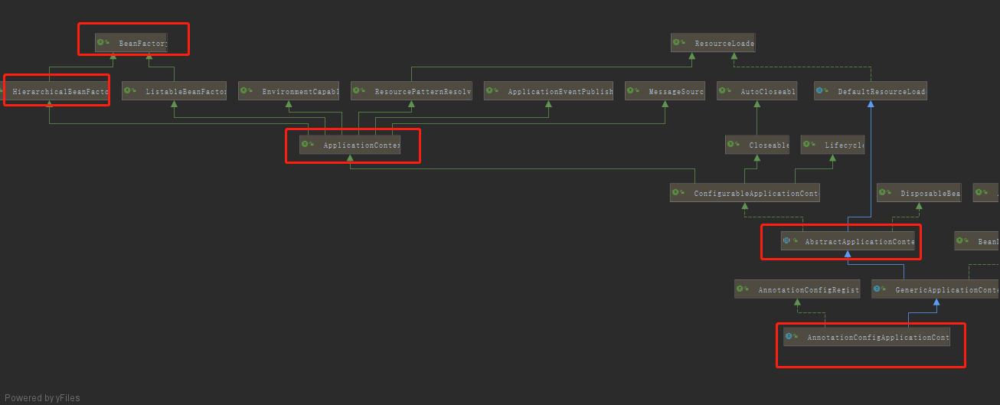

先来看一下官方文档中关于BeanFactory和ApplicationContext的描述。
```
The org.springframework.beans and org.springframework.context packages are the basis for Spring Framework’s IoC container. The BeanFactoryinterface provides an advanced configuration mechanism capable of managing any type of object.ApplicationContextis a sub-interface ofBeanFactory. It adds:

Easier integration with Spring’s AOP features

Message resource handling (for use in internationalization)

Event publication

Application-layer specific contexts such as the WebApplicationContext for use in web applications.

docs.spring.io/spring/docs…
```
从官方文档可以了解到：
- BeanFactory接口提供了能够管理任何类型对象的高级配置机制。
- ApplicationContext是BeanFactory的子接口，它增加了如下一些功能：

##### 更容易与 Spring 的 AOP 集成
- 消息资源处理，用于国际化
- 事件发布
- 特定于应用程序层的上下文，如用于 web 应用程序的WebApplicationContext。


#### 源码简析
```
public interface ApplicationContext extends EnvironmentCapable, ListableBeanFactory, HierarchicalBeanFactory,
		MessageSource, ApplicationEventPublisher, ResourcePatternResolver
```

```
public interface ListableBeanFactory extends BeanFactory
```

从源码可以证实到，ApplicationContext继承了BeanFactory。

```
@Configurable
public class Main {

    @Autowired
    BeanFactory beanFactory;

    public static void main(String[] args) {
        AnnotationConfigApplicationContext context = new AnnotationConfigApplicationContext(Main.class);
        Main bean = context.getBean(Main.class);
        // false
        System.out.println(context == bean.beanFactory);
        context.close();
    }
}
```
AnnotationConfigApplicationContext是ApplicationContext的一个实现类，换而言之，AnnotationConfigApplicationContext也是BeanFactory的一个实现类。
但是，运行上述代码，System.out.println(context == bean.beanFactory);的输出结果为false。
这是不是意味着，在容器中，ApplicationContext和BeanFactory是两个不同的实例对象呢？

#### BeanFactory 和 ApplicationContext
在AnnotationConfigApplicationContext中有一个getBeanFactory方法。
准确来说，是org.springframework.context.support.AbstractApplicationContext#getBeanFactory。
```
@Configurable
public class Main {

    @Autowired
    BeanFactory beanFactory;

    public static void main(String[] args) {
        AnnotationConfigApplicationContext context = new AnnotationConfigApplicationContext(Main.class);
        Main bean = context.getBean(Main.class);
        // false
        System.out.println(context == bean.beanFactory);
        // true
        System.out.println(context.getBeanFactory() == bean.beanFactory);
        context.close();
    }
}
```
AbstractApplicationContext是ApplicationContext的抽象实现。
AnnotationConfigApplicationContext继承了GenericApplicationContext，而GenericApplicationContext又继承了AbstractApplicationContext。




在AbstractApplicationContext中，所有BeanFactory接口的实现，都是委托给了BeanFactory对象。


```
// AbstractApplicationContext#getBean(java.lang.Class<T>, java.lang.Object...)
public <T> T getBean(Class<T> requiredType, Object... args) throws BeansException {
  assertBeanFactoryActive();
  return getBeanFactory().getBean(requiredType, args);
}
```
```
// AbstractApplicationContext#getBeanFactory
public abstract ConfigurableListableBeanFactory getBeanFactory() throws IllegalStateException;
```
getBeanFactory()是一个抽象方法用。
GenericApplicationContext实现了该抽象方法：
```
public class GenericApplicationContext extends AbstractApplicationContext implements BeanDefinitionRegistry {

	private final DefaultListableBeanFactory beanFactory;
	...
	public final ConfigurableListableBeanFactory getBeanFactory() {
		return this.beanFactory;
	}
 	...
}
```
##### 总结
ApplicationContext是BeanFactory的子接口，但是ApplicationContext的实例对象和BeanFactory的实例对象并不是同一个。
在ApplicationContext的实现中，有一个成员变量DefaultListableBeanFactory beanFactory，所有和BeanFactory接口相关的功能都是委派给这个成员变量来实现的。
ApplicationContext实现类中的beanFactory成员变量和容器中的BeanFactory才是同一个实例对象。

