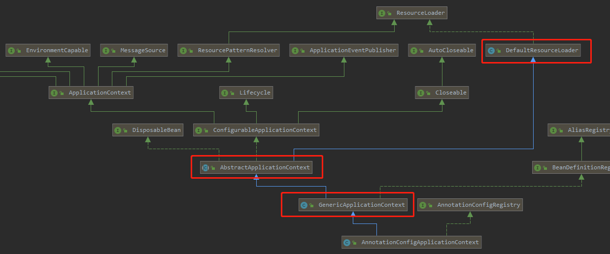
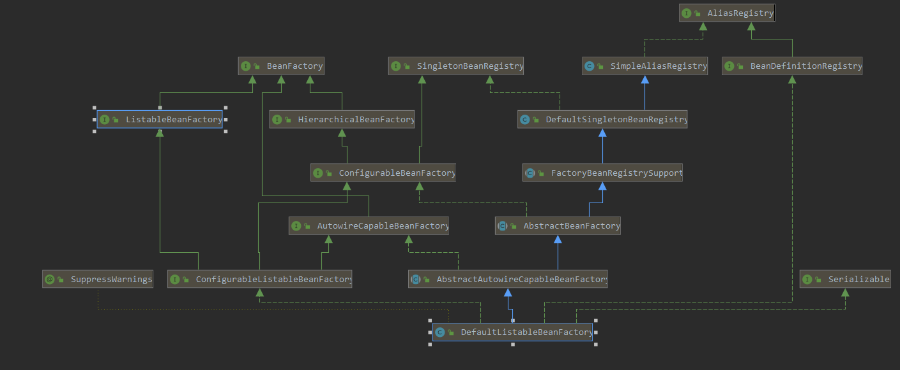

```
@Configuration 
@ComponentScan(value = "com.evan.service",includeFilters = {
        @ComponentScan.Filter(type = FilterType.ANNOTATION,classes = {Service.class})},
        useDefaultFilters = false)
public class MainConfig {
    // 给spring注入一个bean 类型为返回值类型 ID为方法名
    @Bean
    public Person person(){
        return new Person("lisi",20);
    }
}

```

```
AnnotationConfigApplicationContext applicationContext = new AnnotationConfigApplicationContext(MainConfig.class);
```


##### AnnotationConfigApplicationContext的继承关系

##### AnnotationConfigApplicationContext的构造函数

`AnnotationConfigApplicationContext` 就是当前上下文的容器，有多个构造函数

```
	public AnnotationConfigApplicationContext(Class<?>... annotatedClasses) {
		/**
		 * 这里由于他有父类，所以会先调用父类的构造方法:
		 * 	看源码得知初始化了DefaultListableBeanFactory
		 *
		 * 然后才调用自己的构造方法:
		 * 1.创建一个读取注解的Bean定义读取器
		 * 	将bean读取完后，会调用DefaultListableBeanFactory注册这个bean
		 */
		this();

       /**
        * 把传入的Class进行注册,Class既可以有@Configuration注解,也可以没有@Configuration注解
        * 怎么注册? 委托给了 org.springframework.context.annotation.AnnotatedBeanDefinitionReader.register 方法进行注册
        * 传入Class 生成  BeanDefinition , 然后通过 注册到 BeanDefinitionRegistry
        */
		register(annotatedClasses);
        // 刷新容器上下文
		refresh();
	}
```


先看`this();`执行自己的无参构造函数，于是先执行父类`GenericApplicationContext`的默认构造函数

---

### 	this();


```
// AnnotationConfigApplicationContext

	/**
	 * Create a new AnnotationConfigApplicationContext that needs to be populated
	 * through {@link #register} calls and then manually {@linkplain #refresh refreshed}.
	 */
	public AnnotationConfigApplicationContext() {
		this.reader = new AnnotatedBeanDefinitionReader(this);
		this.scanner = new ClassPathBeanDefinitionScanner(this);
	}
```


   

初始化子类时会先初始化父类，会默认调用父类无参构造器。AnnotationConfigApplicationContext继承了GenericApplicationContext，
在GenericApplicationContext的无参构造器中，创建了BeanFactory的具体实现类DefaultListableBeanFactory。
spring中的BeanFactory就是在这里被实例化的，并且使用DefaultListableBeanFactory做的BeanFactory的默认实现。


```
	/**
	 * Create a new GenericApplicationContext.
	 * @see #registerBeanDefinition
	 * @see #refresh
	 */
	public GenericApplicationContext() {
        // 初始化一个beanFactory
		this.beanFactory = new DefaultListableBeanFactory();
	}

```

- `DefaultListableBeanFactory`的用途:**spring加载的bean都会放到这里面去**，上面的MainConfig就是在`DefaultListableBeanFactory`里面。
- `GenericApplicationContext`的父类`AbstractApplicationContext`，包括`AbstractApplicationContext`的父类`DefaultResourceLoader`都有默认构造函数

```
public AbstractApplicationContext() {
		this.resourcePatternResolver = getResourcePatternResolver();
	}

public DefaultResourceLoader() {
		this.classLoader = ClassUtils.getDefaultClassLoader();
	}
```
这些提前初始化的属性到后面都会用到





AnnotationConfigApplicationContext的构造器中还创建了两个对象：AnnotatedBeanDefinitionReader 和 ClassPathBeanDefinitionScanner。

#### AnnotatedBeanDefinitionReader

这时候再回去看`AnnotationConfigApplicationContext(Class<?>... annotatedClasses)`构造函数中的`this();`

```
public AnnotationConfigApplicationContext() {
		/**
		 * 创建一个读取注解的BeanDefinition读取器
		 *
		 * 完成spring内部后置处理器 BeanDefinition的注册
		 */
		this.reader = new AnnotatedBeanDefinitionReader(this);

		/**
		 * 创建BeanDefinition扫描器
		 * 可以用来扫描包或者类，继而转换为bd
		 *
		 * spring默认的扫描器其实不是这个scanner对象
		 * 而是在后面自己又重新new了一个ClassPathBeanDefinitionScanner
		 * spring在执行工程后置处理器ConfigurationClassPostProcessor时，去扫描包时会new一个ClassPathBeanDefinitionScanner
		 *
		 * 这里的scanner仅仅是为了程序可以手动调用AnnotationConfigApplicationContext对象的scan方法
		 *
		 */
		this.scanner = new ClassPathBeanDefinitionScanner(this);
	}
```

---
##### AnnotatedBeanDefinitionReader的构造函数

`AnnotationConfigApplicationContext`默认的构造函数只有两行代码，它们之间是互不影响。本文只讲解第一行代码`this.reader = new AnnotatedBeanDefinitionReader(this);`

创建AnnotatedBeanDefinitionReader对象。spring在创建reader的时候把this当做了参数传给了构造器。也就是说，reader对象里面包含了一个this对象，也就是AnnotationConfigApplicationContext对象。AnnotationConfigApplicationContext 实现了BeanDefinitionRegistry接口。点开this.reader = new AnnotatedBeanDefinitionReader(this);


```
public AnnotatedBeanDefinitionReader(BeanDefinitionRegistry registry) {
		this(registry, getOrCreateEnvironment(registry));
	}
```

从传入的BeanDefinitionRegistry对象，也就是AnnotationConfigApplicationContext对象中获取Environment（共用同一个Environment），
然后又接着调用另一个构造器。点开源码：

```
public AnnotatedBeanDefinitionReader(BeanDefinitionRegistry registry, Environment environment) {
		Assert.notNull(registry, "BeanDefinitionRegistry must not be null");
		Assert.notNull(environment, "Environment must not be null");
		this.registry = registry;
		this.conditionEvaluator = new ConditionEvaluator(registry, environment, null);
		/**
		 * registerAnnotationConfigProcessors
		 * 根据名字顾名思义就是->注册注解配置的的处理器
		 * 也就是这个方法里面会注册一些用于处理注解的处理器
		 */
		AnnotationConfigUtils.registerAnnotationConfigProcessors(this.registry);
	}
```

在这个构造器中，执行了一个非常重要的方法`AnnotationConfigUtils.registerAnnotationConfigProcessors(this.registry);`，
顾名思义，spring通过这个方法注册了解析注解配置相关的处理器。点开源码：


```
// AnnotationConfigUtils

// 在给定注册表中注册所有相关的批注后处理器
public static void registerAnnotationConfigProcessors(BeanDefinitionRegistry registry) {
		registerAnnotationConfigProcessors(registry, null);
	}
	
public static Set<BeanDefinitionHolder> registerAnnotationConfigProcessors(
			BeanDefinitionRegistry registry, @Nullable Object source) {

		// 获取beanFactory也就是DefaultListableBeanFactory
		DefaultListableBeanFactory beanFactory = unwrapDefaultListableBeanFactory(registry);
		if (beanFactory != null) {
			if (!(beanFactory.getDependencyComparator() instanceof AnnotationAwareOrderComparator)) {
				/**
				 * AnnotationAwareOrderComparator主要能解析@Order和@Priority
				 */
				beanFactory.setDependencyComparator(AnnotationAwareOrderComparator.INSTANCE);
			}
			if (!(beanFactory.getAutowireCandidateResolver() instanceof ContextAnnotationAutowireCandidateResolver)) {
				/**
				 * ContextAnnotationAutowireCandidateResolver提供处理延迟加载的功能
				 */
				beanFactory.setAutowireCandidateResolver(new ContextAnnotationAutowireCandidateResolver());
			}
		}

		Set<BeanDefinitionHolder> beanDefs = new LinkedHashSet<>(8);
		/**
		 * spring默认的BeanDefinition的注册，很重要，需要理解每个bean的类型
		 */
		// 注册ConfigurationAnnotationProcessor
		if (!registry.containsBeanDefinition(CONFIGURATION_ANNOTATION_PROCESSOR_BEAN_NAME)) {
			RootBeanDefinition def = new RootBeanDefinition(ConfigurationClassPostProcessor.class);
			def.setSource(source);
			beanDefs.add(registerPostProcessor(registry, def, CONFIGURATION_ANNOTATION_PROCESSOR_BEAN_NAME));
		}

		// 注册AutowiredAnnotationBeanPostProcessor
		if (!registry.containsBeanDefinition(AUTOWIRED_ANNOTATION_PROCESSOR_BEAN_NAME)) {
			RootBeanDefinition def = new RootBeanDefinition(AutowiredAnnotationBeanPostProcessor.class);
			def.setSource(source);
			beanDefs.add(registerPostProcessor(registry, def, AUTOWIRED_ANNOTATION_PROCESSOR_BEAN_NAME));
		}

		// 注册RequiredAnnotationBeanPostProcessor
		if (!registry.containsBeanDefinition(REQUIRED_ANNOTATION_PROCESSOR_BEAN_NAME)) {
			RootBeanDefinition def = new RootBeanDefinition(RequiredAnnotationBeanPostProcessor.class);
			def.setSource(source);
			beanDefs.add(registerPostProcessor(registry, def, REQUIRED_ANNOTATION_PROCESSOR_BEAN_NAME));
		}

		// Check for JSR-250 support, and if present add the CommonAnnotationBeanPostProcessor.
		// 注册CommonAnnotationBeanPostProcessor
		if (jsr250Present && !registry.containsBeanDefinition(COMMON_ANNOTATION_PROCESSOR_BEAN_NAME)) {
			RootBeanDefinition def = new RootBeanDefinition(CommonAnnotationBeanPostProcessor.class);
			def.setSource(source);
			beanDefs.add(registerPostProcessor(registry, def, COMMON_ANNOTATION_PROCESSOR_BEAN_NAME));
		}

		// Check for JPA support, and if present add the PersistenceAnnotationBeanPostProcessor.
		// 注册PersistenceAnnotationProcessor
		if (jpaPresent && !registry.containsBeanDefinition(PERSISTENCE_ANNOTATION_PROCESSOR_BEAN_NAME)) {
			RootBeanDefinition def = new RootBeanDefinition();
			try {
				def.setBeanClass(ClassUtils.forName(PERSISTENCE_ANNOTATION_PROCESSOR_CLASS_NAME,
						AnnotationConfigUtils.class.getClassLoader()));
			}
			catch (ClassNotFoundException ex) {
				throw new IllegalStateException(
						"Cannot load optional framework class: " + PERSISTENCE_ANNOTATION_PROCESSOR_CLASS_NAME, ex);
			}
			def.setSource(source);
			beanDefs.add(registerPostProcessor(registry, def, PERSISTENCE_ANNOTATION_PROCESSOR_BEAN_NAME));
		}

		// 注册EventListenerMethodProcessor
		if (!registry.containsBeanDefinition(EVENT_LISTENER_PROCESSOR_BEAN_NAME)) {
			RootBeanDefinition def = new RootBeanDefinition(EventListenerMethodProcessor.class);
			def.setSource(source);
			beanDefs.add(registerPostProcessor(registry, def, EVENT_LISTENER_PROCESSOR_BEAN_NAME));
		}

		// 注册DefaultEventListenerFactory
		if (!registry.containsBeanDefinition(EVENT_LISTENER_FACTORY_BEAN_NAME)) {
			RootBeanDefinition def = new RootBeanDefinition(DefaultEventListenerFactory.class);
			def.setSource(source);
			beanDefs.add(registerPostProcessor(registry, def, EVENT_LISTENER_FACTORY_BEAN_NAME));
		}

		return beanDefs;
	}
```


一一进行分析。 

####### unwrapDefaultListableBeanFactory  返回一个 DefaultListableBeanFactory
###### 注册ConfigurationClassPostProcessor
```
public static final String CONFIGURATION_ANNOTATION_PROCESSOR_BEAN_NAME =
			"org.springframework.context.annotation.internalConfigurationAnnotationProcessor";

if (!registry.containsBeanDefinition(CONFIGURATION_ANNOTATION_PROCESSOR_BEAN_NAME)) {
			RootBeanDefinition def = new RootBeanDefinition(ConfigurationClassPostProcessor.class);
			def.setSource(source);
			beanDefs.add(registerPostProcessor(registry, def, CONFIGURATION_ANNOTATION_PROCESSOR_BEAN_NAME));
		}
```

ConfigurationClassPostProcessor是一个工厂后置处理器，这个后置处理器非常重要，基本上类上面的注解都在这里面判断并解析，
spring的包扫描也在里面完成。


 ###### 注册AutowiredAnnotationBeanPostProcessor
```
public static final String AUTOWIRED_ANNOTATION_PROCESSOR_BEAN_NAME =
			"org.springframework.context.annotation.internalAutowiredAnnotationProcessor";

if (!registry.containsBeanDefinition(AUTOWIRED_ANNOTATION_PROCESSOR_BEAN_NAME)) {
			RootBeanDefinition def = new RootBeanDefinition(AutowiredAnnotationBeanPostProcessor.class);
			def.setSource(source);
			beanDefs.add(registerPostProcessor(registry, def, AUTOWIRED_ANNOTATION_PROCESSOR_BEAN_NAME));
		}
```
就是处理@Autowired的，它是一个bean的后置处理器，在bean的属性注入的时候会用到

###### 注册RequiredAnnotationBeanPostProcessor
```
public static final String REQUIRED_ANNOTATION_PROCESSOR_BEAN_NAME =
			"org.springframework.context.annotation.internalRequiredAnnotationProcessor";

if (!registry.containsBeanDefinition(REQUIRED_ANNOTATION_PROCESSOR_BEAN_NAME)) {
			RootBeanDefinition def = new RootBeanDefinition(RequiredAnnotationBeanPostProcessor.class);
			def.setSource(source);
			beanDefs.add(registerPostProcessor(registry, def, REQUIRED_ANNOTATION_PROCESSOR_BEAN_NAME));
		}
```
处理@Required的，它是一个bean的后置处理器，在bean的属性注入的时候会用到

###### 注册CommonAnnotationBeanPostProcessor
```
public static final String COMMON_ANNOTATION_PROCESSOR_BEAN_NAME =
			"org.springframework.context.annotation.internalCommonAnnotationProcessor";

if (jsr250Present && !registry.containsBeanDefinition(COMMON_ANNOTATION_PROCESSOR_BEAN_NAME)) {
			RootBeanDefinition def = new RootBeanDefinition(CommonAnnotationBeanPostProcessor.class);
			def.setSource(source);
			beanDefs.add(registerPostProcessor(registry, def, COMMON_ANNOTATION_PROCESSOR_BEAN_NAME));
		}
```

是处理一些公共注解的，它是一个bean的后置处理器，可以处理@PostConstruct和@PreDestroy还有@Resource等

提示： 这里有一个jsr250Present校验
```
private static final boolean jsr250Present =
			ClassUtils.isPresent("javax.annotation.Resource", AnnotationConfigUtils.class.getClassLoader());
```
就是判断@Resource的路径存不存在，不会不存在，因为这是jdk里面的

###### 注册PersistenceAnnotationBeanPostProcessor
```
public static final String PERSISTENCE_ANNOTATION_PROCESSOR_BEAN_NAME =
			"org.springframework.context.annotation.internalPersistenceAnnotationProcessor";

if (jpaPresent && !registry.containsBeanDefinition(PERSISTENCE_ANNOTATION_PROCESSOR_BEAN_NAME)) {
			RootBeanDefinition def = new RootBeanDefinition();
			try {
				def.setBeanClass(ClassUtils.forName(PERSISTENCE_ANNOTATION_PROCESSOR_CLASS_NAME,
						AnnotationConfigUtils.class.getClassLoader()));
			}
			catch (ClassNotFoundException ex) {
				throw new IllegalStateException(
						"Cannot load optional framework class: " + PERSISTENCE_ANNOTATION_PROCESSOR_CLASS_NAME, ex);
			}
			def.setSource(source);
			beanDefs.add(registerPostProcessor(registry, def, PERSISTENCE_ANNOTATION_PROCESSOR_BEAN_NAME));
		}
```
这里先看jpaPresent
```

private static final String PERSISTENCE_ANNOTATION_PROCESSOR_CLASS_NAME =
			"org.springframework.orm.jpa.support.PersistenceAnnotationBeanPostProcessor";

private static final boolean jpaPresent =
			ClassUtils.isPresent("javax.persistence.EntityManagerFactory", AnnotationConfigUtils.class.getClassLoader()) &&
			ClassUtils.isPresent(PERSISTENCE_ANNOTATION_PROCESSOR_CLASS_NAME, AnnotationConfigUtils.class.getClassLoader());
```

就是判断是否存在PersistenceAnnotationBeanPostProcessor这个类，很明显这是对jpa的处理，所以需要引入spring-orm的包，
没有引入的话则spring不会注册这个类

###### 注册EventListenerMethodProcessor
```
public static final String EVENT_LISTENER_PROCESSOR_BEAN_NAME =
			"org.springframework.context.event.internalEventListenerProcessor";

if (!registry.containsBeanDefinition(EVENT_LISTENER_PROCESSOR_BEAN_NAME)) {
			RootBeanDefinition def = new RootBeanDefinition(EventListenerMethodProcessor.class);
			def.setSource(source);
			beanDefs.add(registerPostProcessor(registry, def, EVENT_LISTENER_PROCESSOR_BEAN_NAME));
		}
```

这是对`@EventListener`注解的处理，spring实现事件监听的方式有很多种，其中一种就是在方法上添加@EventListener注解方式式实现

###### 注册DefaultEventListenerFactory
EventListenerMethodProcessor中会调用DefaultEventListenerFactory的方法，注册的具体实现是由DefaultEventListenerFactory处理
```
public static final String EVENT_LISTENER_FACTORY_BEAN_NAME =
			"org.springframework.context.event.internalEventListenerFactory";

if (!registry.containsBeanDefinition(EVENT_LISTENER_FACTORY_BEAN_NAME)) {
			RootBeanDefinition def = new RootBeanDefinition(DefaultEventListenerFactory.class);
			def.setSource(source);
			beanDefs.add(registerPostProcessor(registry, def, EVENT_LISTENER_FACTORY_BEAN_NAME));
		}
```

这个也是跟事件监听有关

###### 注册以上bean的方法registerPostProcessor()

上面用到了`registerPostProcessor`方法来注册beanDefinition
```
private static BeanDefinitionHolder registerPostProcessor(
			BeanDefinitionRegistry registry, RootBeanDefinition definition, String beanName) {

		definition.setRole(BeanDefinition.ROLE_INFRASTRUCTURE);

		/**
		 * registry就是AnnotationApplicationContext
		 * 这里是调用父类GenericApplicationContext中的registerBeanDefinition方法
		 * 调用beanFactory将spring默认的BeanDefinition注册进去
		 */
		registry.registerBeanDefinition(beanName, definition);
		return new BeanDefinitionHolder(definition, beanName);
	}
	
public void registerBeanDefinition(String beanName, BeanDefinition beanDefinition)
			throws BeanDefinitionStoreException {

		// 一开始就初始化了DefaultListableBeanFactory
		this.beanFactory.registerBeanDefinition(beanName, beanDefinition);
	}
```
再往beanFactory.registerBeanDefinition(beanName, beanDefinition);里面跟进，其实就是
```
this.beanDefinitionMap.put(beanName, beanDefinition);
this.beanDefinitionNames.add(beanName);
```
来看一下DefaultListableBeanFactory的属性
```
private final Map<String, BeanDefinition> beanDefinitionMap = new ConcurrentHashMap<>(256);
private volatile List<String> beanDefinitionNames = new ArrayList<>(256);
```
###### 处理注解的方法processCommonDefinitionAnnotations()
```
public static void processCommonDefinitionAnnotations(AnnotatedBeanDefinition abd) {
		processCommonDefinitionAnnotations(abd, abd.getMetadata());
	}
	
    /**
	 * 检查通用的注解
	 * 并添加到数据结构中去
	 * @param abd
	 * @param metadata
	 */
	static void processCommonDefinitionAnnotations(AnnotatedBeanDefinition abd, AnnotatedTypeMetadata metadata) {
		AnnotationAttributes lazy = attributesFor(metadata, Lazy.class);
		if (lazy != null) {
			abd.setLazyInit(lazy.getBoolean("value"));
		}
		else if (abd.getMetadata() != metadata) {
			lazy = attributesFor(abd.getMetadata(), Lazy.class);
			if (lazy != null) {
				abd.setLazyInit(lazy.getBoolean("value"));
			}
		}

		if (metadata.isAnnotated(Primary.class.getName())) {
			abd.setPrimary(true);
		}
		AnnotationAttributes dependsOn = attributesFor(metadata, DependsOn.class);
		if (dependsOn != null) {
			abd.setDependsOn(dependsOn.getStringArray("value"));
		}

		if (abd instanceof AbstractBeanDefinition) {
			AbstractBeanDefinition absBd = (AbstractBeanDefinition) abd;
			AnnotationAttributes role = attributesFor(metadata, Role.class);
			if (role != null) {
				absBd.setRole(role.getNumber("value").intValue());
			}
			AnnotationAttributes description = attributesFor(metadata, Description.class);
			if (description != null) {
				absBd.setDescription(description.getString("value"));
			}
		}
	}
```
这个方法`processCommonDefinitionAnnotations()`在后面会用到，注册`beanDefinition`的时候会先处理类当中的通用注解，
析源码可以知道他主要处理`Lazy`、`DependOn`、 `Primary` 、`Role`等注解，然后将注解的信息添加到数据结构BeanDefinition中去，
<font color='red'>`BeanDefinition`就是描述bean注册的信息</font>。


上面注册的7个内部bean是没有任何注解的，所以没用到这个方法。


###### AnnotatedBeanDefinitionReader很重要的方法register()
```

public void register (Class<?>... annotatedClasses) {
		for (Class<?> annotatedClass : annotatedClasses) {
			registerBean(annotatedClass);
		}
	}
```
这个方法在`AnnotationConfigApplicationContext`的默认构造函数执行完后在来具体分析，因为spring加载流程还没到这里，可以先看下第2行的代码
```
public AnnotationConfigApplicationContext(Class<?>... annotatedClasses) {
		this();
		register(annotatedClasses);
		refresh();
	}
	
	/**
	 * 注册一个或多个bean给容器
	 * 比如有新加的类可以调用这个方法
	 * 但是注册之后需要手动调用refresh方法
	 */
public void register(Class<?>... annotatedClasses) {
		Assert.notEmpty(annotatedClasses, "At least one annotated class must be specified");
		this.reader.register(annotatedClasses);
	}
```
`this.reader.register(annotatedClasses);`的reader就是默认构造函数初始化的`AnnotatedBeanDefinitionReader`

###### new ClassPathBeanDefinitionScanner之前

到此为止，`this.reader = new AnnotatedBeanDefinitionReader(this);`就执行完了

可以看一下`beanDefinitionMap`中大小

   

除了jpa的那个`bean(beanName)`为`org.springframework.context.annotation.internalPersistenceAnnotationProcessor)`没有之外，
其余的6个内部bean都注册进DefaultListableBeanFactory中去了

---
###### AnnotationConfigUtils.registerAnnotationConfigProcessors() 方法的作用
1. 该方法从传入的BeanDefinitionRegistry对象，也就是AnnotationConfigApplicationContext对象中获取到DefaultListableBeanFactory对象。
2. 为获取的DefaultListableBeanFactory对象设置属性
3. 往DefaultListableBeanFactory对象中注册BeanDefinition，注册的是一些spring内置的PostProcessor的BeanDefinition。注意，此时只是注册BeanDefinition，
并没有实例化bean。